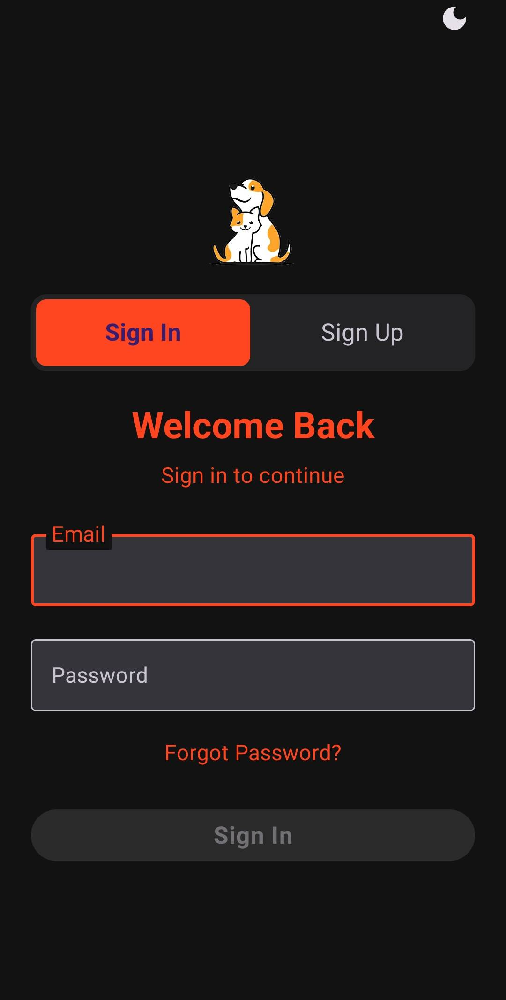
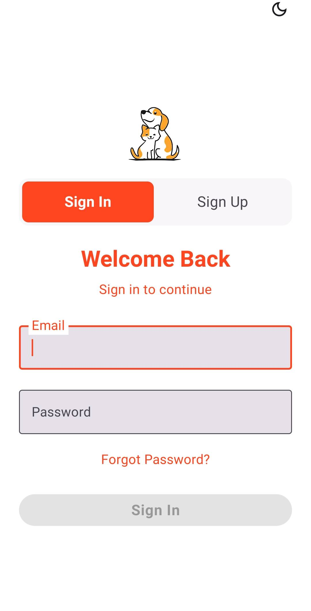
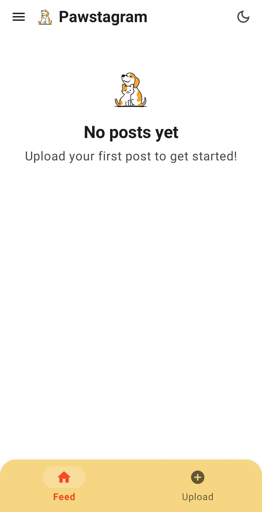
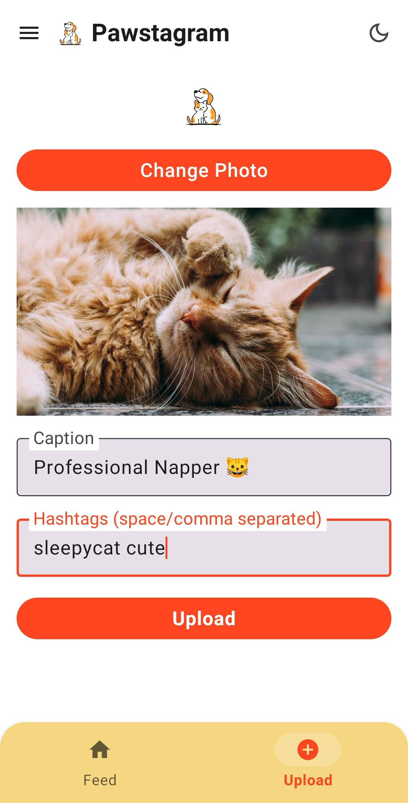
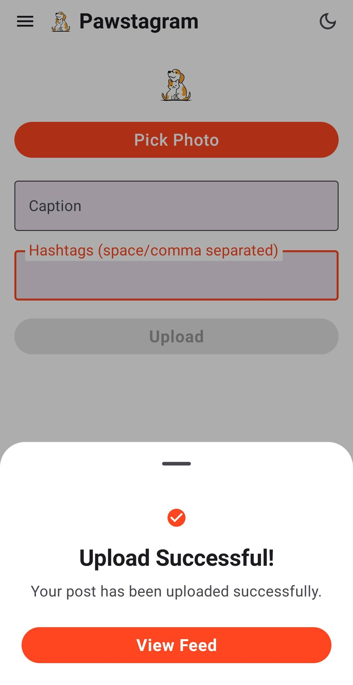
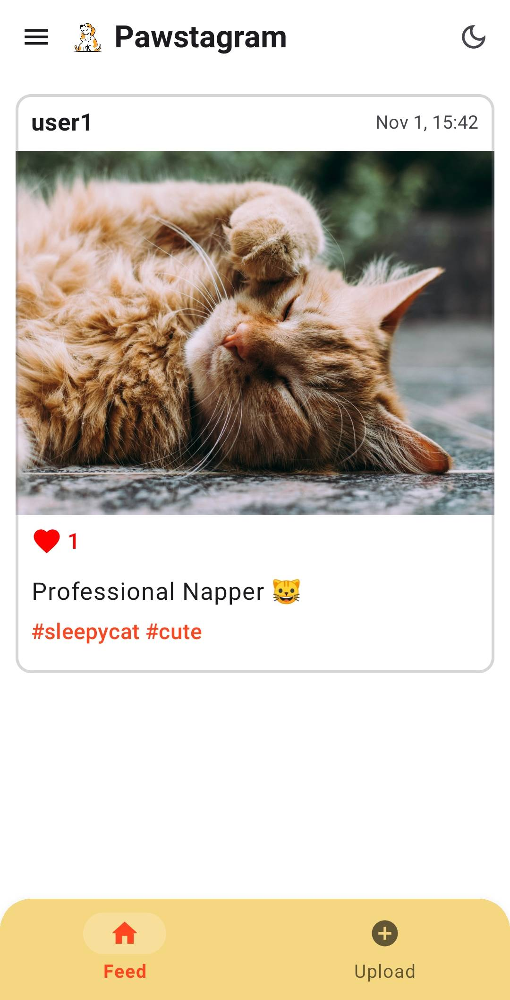

# Pawstagram 📸🐾

<p align="center">
  
</p>


Pawstagram is an android app where pet lovers can share cute moments of their pets, Built with Kotlin and Jetpack Compose which focuses on delivering a smooth, modern, and joyful social experience for pet owners.

##  Features

-  **Authentication**
  - Email/Password sign-up and sign-in
  - Password reset functionality

-  **Feed & Posts**
  - Browse posts in a beautiful feed
  - Upload photos with captions and hashtags
  - Like posts
  - Real-time post updates

-  **UI/UX**
  - Modern Material Design 3
  - Dark mode support
  - Responsive design
  - Custom logo branding

-  **Backend Services**
  - Cloudinary for image storage
  - Firebase Firestore for post metadata
  - Firebase Authentication

##  Tech Stack

- **Language**: Kotlin
- **UI Framework**: Jetpack Compose
- **Architecture**: MVVM (Model-View-ViewModel)
- **Backend Services**:
  - Firebase Authentication
  - Firebase Firestore
  - Cloudinary (Image Storage)
- **Libraries**:
  - Jetpack Compose (UI)
  - Material Design 3
  - Navigation Compose
  - Coil (Image Loading)
  - OkHttp (Network Requests)
  - Room (Local Database - optional)
  - Kotlin Coroutines & Flow

##  Prerequisites

Before you begin, ensure you have:

- **Android Studio** 
- **JDK 11** or higher
- **Android SDK** (API level 24 or higher)
- **Firebase Account** (free tier available)
- **Cloudinary Account** (free tier available)


##  Setup Instructions

### 1. Clone the Repository

```bash
git clone <repository-url>
cd Pawstagram
```

### 2. Firebase Setup

1. **Create a Firebase Project**:
   - Go to [Firebase Console](https://console.firebase.google.com/)
   - Click "Add project" and follow the setup wizard
   - Enable **Authentication** and **Firestore Database**

2. **Add Android App to Firebase**:
   - Click the Android icon in Firebase Console
   - Package name: `com.example.pawstagram`
   - Download `google-services.json`

3. **Place google-services.json**:
   - Copy the downloaded `google-services.json` to `app/google-services.json`
   - This file contains your Firebase API keys and should NOT be committed to git
   - The repository includes `app/google-services.json.example` as a template only

4. **Enable Firebase Services**:
   - **Authentication**: Enable Email/Password and Google Sign-In
   - **Firestore**: Create a database in test mode (for development)

### 3. Cloudinary Setup

1. **Create Cloudinary Account**:
   - Sign up at [Cloudinary](https://cloudinary.com/) (free tier)

2. **Create Upload Preset**:
   - Go to Settings → Upload
   - Create an **Unsigned Upload Preset**
   - Name it (`pawstagram_unsigned`)
   - Set folder: `pawstagram/images`
   - Save

3. **Get Your Cloud Name**:
   - Find your cloud name in the Cloudinary dashboard

4. **Configure in App**:
   - Open `app/src/main/res/values/strings.xml`
   - Update the following values:
     ```xml
     <string name="cloudinary_cloud_name">YOUR_CLOUD_NAME</string>
     <string name="cloudinary_upload_preset">YOUR_UNSIGNED_UPLOAD_PRESET</string>
     ```

### 4. Build and Run

1. **Open Project in Android Studio**
   - Open the `Pawstagram` folder in Android Studio
   - Wait for Gradle sync to complete

2. **Build the Project**:
   ```bash
   ./gradlew build
   ```

3. **Run on Device/Emulator**:
   - Connect an Android device or start an emulator
   - Click "Run" in Android Studio or use:
     ```bash
     ./gradlew installDebug
     ```

## Project Structure

```
Pawstagram/
├── app/
│   ├── src/
│   │   └── main/
│   │       ├── java/com/example/pawstagram/
│   │       │   ├── data/
│   │       │   │   ├── auth/           # Authentication repository
│   │       │   │   └── firebase/       # Firebase Firestore operations
│   │       │   ├── model/              # Data models
│   │       │   ├── ui/
│   │       │   │   ├── screens/        # Compose screens
│   │       │   │   ├── theme/          # Theme configuration
│   │       │   │   └── *ViewModel.kt    # ViewModels
│   │       │   └── MainActivity.kt     # Main activity
│   │       ├── res/
│   │       │   ├── drawable/           # Images (logo.png)
│   │       │   └── values/
│   │       │       └── strings.xml      # Cloudinary config
│   │       └── AndroidManifest.xml
│   ├── google-services.json            # Firebase config
│   └── build.gradle.kts
├── gradle/
│   └── libs.versions.toml             # Dependency versions
└── README.md
```


## UI Features

- **Cards**: Clean white cards with subtle borders
- **Dark Mode**: Fully supported with appropriate color schemes


## App Screens

1. **Sign In/Sign Up Screen**: Authentication with email/password or Google
2. **Feed Screen**: Browse all posts with like functionality
3. **Upload Screen**: Add new posts with image, caption, and hashtags
4. **Navigation Drawer**: User profile and logout

## Screenshots

<p>
  
  
  
  
  
  
</p>

<p align="center">
  
</p>


